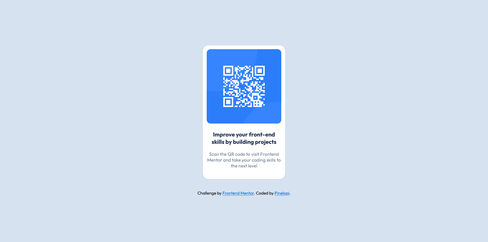

This is a solution to the [QR code component challenge on Frontend Mentor](https://www.frontendmentor.io/challenges/qr-code-component-iux_sIO_H).

Desktop version:

Mobile version:

Built with
- Semantic HTML5 markup
- CSS custom properties
- CSS Flexbox

--Coded by: https://www.frontendmentor.io/profile/Pinelopi-Romeou